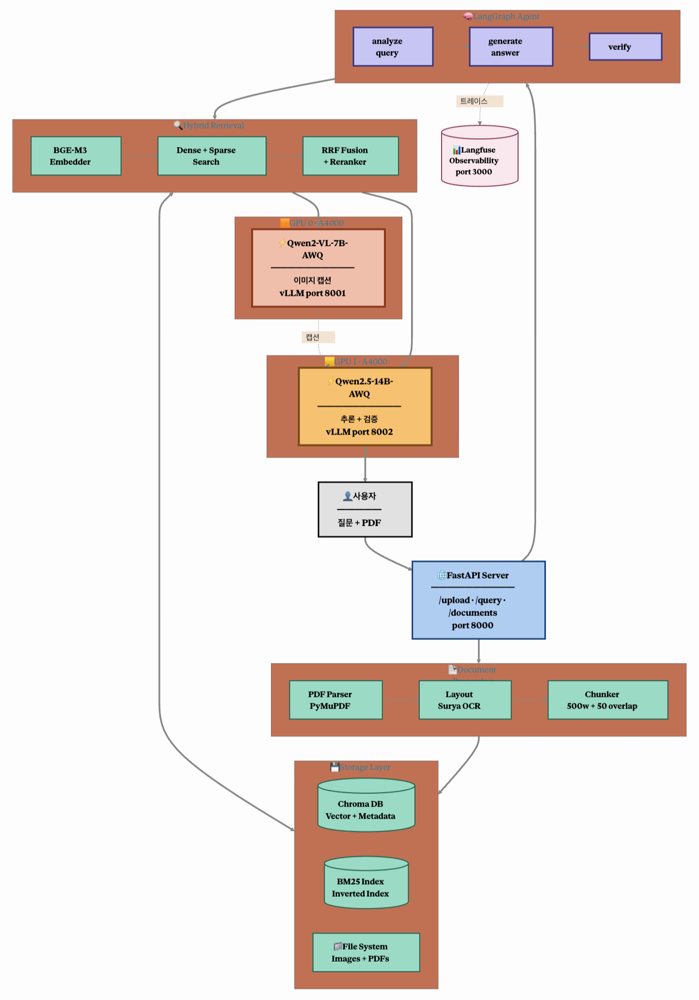
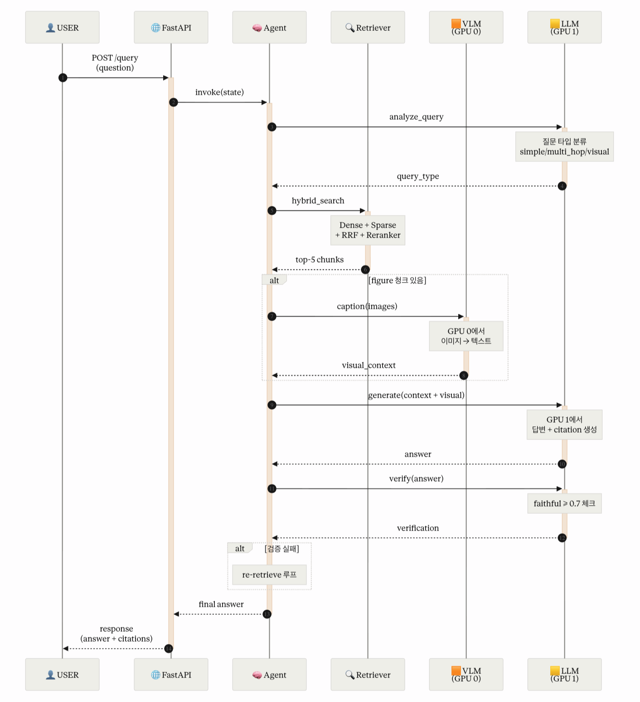
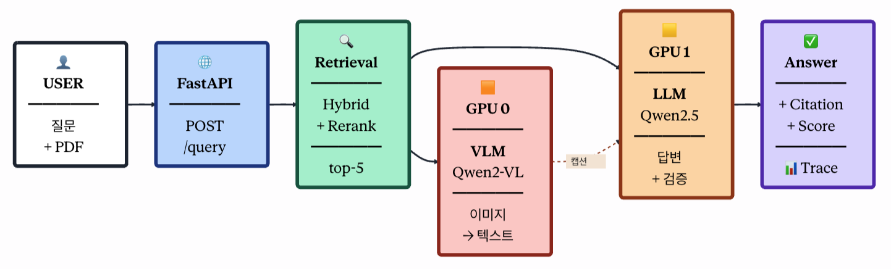
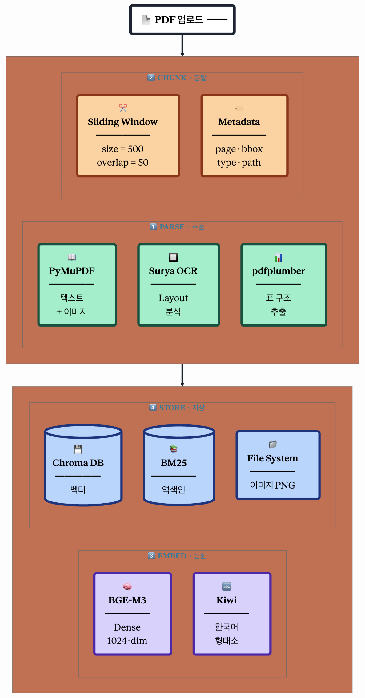

# SecureDoc Core

PDF 문서 기반 멀티모달 RAG(Retrieval-Augmented Generation) 시스템

---

## 시스템 개요

SecureDoc Core는 PDF 문서를 업로드하면 텍스트/이미지/표를 파싱하고, 하이브리드 검색과 LLM을 결합하여 질문에 대한 정확한 답변과 근거(citation)를 제공하는 엔드투엔드 RAG 파이프라인입니다.

---

## 아키텍처

### 1. 전체 시스템 구성도



| 구성 요소 | 역할 | 상세 |
|---|---|---|
| **FastAPI Server** | API 게이트웨이 | `/upload`, `/query`, `/documents` 엔드포인트 (port 8000) |
| **LangGraph Agent** | 오케스트레이션 | `analyze_query` → `generate_answer` → `verify` 3단계 에이전트 |
| **Hybrid Retrieval** | 검색 엔진 | BGE-M3 Embedder + Dense/Sparse Search + RRF Fusion + Reranker |
| **VLM (GPU 0)** | 이미지 캡셔닝 | Qwen2-VL-7B-AWQ, vLLM port 8001 |
| **LLM (GPU 1)** | 추론 및 검증 | Qwen2.5-14B-AWQ, vLLM port 8002 |
| **Langfuse** | 관측성(Observability) | 트레이스 수집 (port 3000) |

### 2. 질의 처리 시퀀스



**처리 흐름:**

1. **질문 분류** — LLM(GPU 1)이 질문 타입을 `simple` / `multi_hop` / `visual`로 분류
2. **하이브리드 검색** — Dense + Sparse + RRF + Reranker를 통해 top-5 청크 검색
3. **이미지 캡셔닝** (조건부) — figure 청크가 포함된 경우 VLM(GPU 0)에서 이미지 → 텍스트 변환
4. **답변 생성** — 검색 컨텍스트 + 비주얼 컨텍스트를 결합하여 LLM(GPU 1)에서 답변 + citation 생성
5. **Faithfulness 검증** — 답변의 faithful 스코어가 0.7 이상인지 체크
6. **재검색 루프** — 검증 실패 시 re-retrieve 후 재생성
7. **최종 응답** — answer + citations를 사용자에게 반환

### 3. 파이프라인 요약



```
USER (질문+PDF) → FastAPI (POST /query) → Retrieval (Hybrid+Rerank, top-5)
    → GPU 0: VLM (Qwen2-VL, 이미지→텍스트)
    → GPU 1: LLM (Qwen2.5, 답변+검증)
    → Answer + Citation + Score + Trace
```

### 4. 문서 인제스트 파이프라인



**PDF 업로드 후 처리 단계:**

| 단계 | 처리 | 도구 |
|---|---|---|
| **PARSE (추출)** | 텍스트+이미지 추출 / 레이아웃 분석 / 표 구조 추출 | PyMuPDF, Surya OCR, pdfplumber |
| **CHUNK (분할)** | Sliding Window (size=500, overlap=50) + 메타데이터(page, bbox, type, path) | - |
| **EMBED (변환)** | Dense 임베딩(1024-dim) + 한국어 형태소 분석 | BGE-M3, Kiwi |
| **STORE (저장)** | 벡터 DB / 역색인 / 이미지 파일 | ChromaDB, BM25, File System |

---

## 기술 스택

- **API**: FastAPI
- **Agent**: LangGraph
- **LLM Serving**: vLLM (Qwen2.5-14B-AWQ, Qwen2-VL-7B-AWQ)
- **Vector DB**: ChromaDB
- **Sparse Search**: BM25 (Inverted Index)
- **Embedding**: BGE-M3 (1024-dim Dense)
- **Korean NLP**: Kiwi (형태소 분석)
- **PDF Parsing**: PyMuPDF, Surya OCR, pdfplumber
- **Observability**: Langfuse
- **GPU**: 2x A4000 (GPU 0: VLM, GPU 1: LLM)

---

## 사전 요구사항

| 항목 | 요구사항 |
|---|---|
| **Python** | 3.11+ |
| **GPU** | NVIDIA GPU 2장 (VRAM 16GB+ 권장) |
| **CUDA** | 12.x |
| **Docker** (선택) | Docker Engine 24+ / Docker Compose v2 |
| **OS** | Linux (Ubuntu 22.04 권장) / macOS (개발용) |

---

## 설치 및 실행

### 방법 1: Docker Compose (권장)

모든 서비스(API, UI, VLM, LLM, Langfuse)를 한 번에 실행합니다.

```bash
# 1. 저장소 클론
git clone <repository-url>
cd SecureDoc_Core

# 2. 환경변수 설정
cp .env.example .env
# .env 파일에서 Langfuse 키 등 필요한 값을 수정

# 3. 전체 서비스 시작
docker compose up -d

# 4. 로그 확인
docker compose logs -f api
```

실행 후 접속:
- **API 서버**: http://localhost:8000
- **웹 UI**: http://localhost:8501
- **API 문서 (Swagger)**: http://localhost:8000/docs
- **Langfuse 대시보드**: http://localhost:3000

### 방법 2: 로컬 실행

VLM/LLM 서버는 별도로 실행되어 있어야 합니다.

```bash
# 1. 가상환경 생성 및 활성화
python -m venv .venv
source .venv/bin/activate

# 2. 의존성 설치
pip install -r requirements.txt

# 3. 환경변수 설정
cp .env.example .env
# .env 파일 수정 (VLM_HOST, LLM_HOST, Langfuse 키 등)

# 4. FastAPI 서버 실행
python app/main.py
# 또는
uvicorn app.main:app --host 0.0.0.0 --port 8000

# 5. Streamlit UI 실행 (별도 터미널)
streamlit run ui/app.py --server.port 8501
```

### VLM/LLM 서버 개별 실행 (vLLM)

```bash
# GPU 0: VLM (이미지 캡셔닝)
python -m vllm.entrypoints.openai.api_server \
  --model Qwen/Qwen2-VL-7B-Instruct-AWQ \
  --port 8001 \
  --quantization awq \
  --max-model-len 4096 \
  --trust-remote-code

# GPU 1: LLM (추론 및 검증)
CUDA_VISIBLE_DEVICES=1 python -m vllm.entrypoints.openai.api_server \
  --model Qwen/Qwen2.5-14B-Instruct-AWQ \
  --port 8002 \
  --quantization awq \
  --max-model-len 8192 \
  --trust-remote-code
```

---

## 환경변수 설정

`.env` 파일에서 다음 항목을 설정합니다:

| 변수명 | 기본값 | 설명 |
|---|---|---|
| `API_HOST` | `0.0.0.0` | FastAPI 바인드 주소 |
| `API_PORT` | `8000` | FastAPI 포트 |
| `VLM_HOST` | `localhost` | VLM 서버 호스트 |
| `VLM_PORT` | `8001` | VLM 서버 포트 |
| `LLM_HOST` | `localhost` | LLM 서버 호스트 |
| `LLM_PORT` | `8002` | LLM 서버 포트 |
| `LANGFUSE_HOST` | `http://localhost:3000` | Langfuse 서버 주소 |
| `LANGFUSE_PUBLIC_KEY` | - | Langfuse Public Key |
| `LANGFUSE_SECRET_KEY` | - | Langfuse Secret Key |

---

## 사용법

### 웹 UI (Streamlit)

1. 브라우저에서 http://localhost:8501 접속
2. 사이드바에서 **PDF 파일 업로드** (업로드 버튼 클릭)
3. 업로드 완료 후 사이드바의 **문서 선택** 드롭다운에서 질의 대상 문서 선택
4. 하단 채팅 입력창에 질문 입력 후 전송
5. 답변과 함께 **신뢰도 점수**, **질문 유형**, **근거(Citation)** 확인

### API 직접 호출

#### 헬스체크

```bash
curl http://localhost:8000/health
# {"status":"ok","service":"SecureDoc Core"}
```

#### PDF 문서 업로드

```bash
curl -X POST http://localhost:8000/upload \
  -F "file=@/path/to/document.pdf"
```

응답 예시:
```json
{
  "doc_id": "a1b2c3d4",
  "filename": "document.pdf",
  "page_count": 15,
  "chunk_count": 42,
  "message": "문서 업로드 및 인덱싱 완료 (42개 청크)"
}
```

#### 질의 (질문하기)

```bash
curl -X POST http://localhost:8000/query \
  -H "Content-Type: application/json" \
  -d '{"question": "이 문서의 핵심 내용은 무엇인가요?", "doc_id": "a1b2c3d4"}'
```

`doc_id`를 생략하면 전체 문서를 대상으로 검색합니다.

응답 예시:
```json
{
  "answer": "이 문서는 ...",
  "citations": [
    {
      "chunk_id": "a1b2c3d4_p3_0",
      "page_num": 3,
      "content_preview": "관련 내용 미리보기...",
      "relevance_score": 0.92
    }
  ],
  "faithfulness_score": 0.85,
  "query_type": "simple",
  "trace_id": "trace-xxxx"
}
```

#### 업로드된 문서 목록 조회

```bash
curl http://localhost:8000/documents
```

---

## 프로젝트 구조

```
SecureDoc_Core/
├── app/
│   ├── main.py              # FastAPI 서버 엔트리포인트
│   ├── config.py            # 환경변수 기반 설정
│   ├── models.py            # Pydantic 데이터 모델
│   ├── agent/               # LangGraph 에이전트
│   │   ├── graph.py         # 에이전트 그래프 정의
│   │   ├── nodes.py         # 에이전트 노드 (분석/생성/검증)
│   │   └── prompts.py       # LLM 프롬프트 템플릿
│   ├── ingest/              # 문서 인제스트 파이프라인
│   │   ├── parser.py        # PDF 파싱 (텍스트/이미지/표)
│   │   ├── chunker.py       # 슬라이딩 윈도우 청킹
│   │   └── embedder.py      # BGE-M3 임베딩 + 한국어 토큰화
│   ├── retrieval/           # 하이브리드 검색
│   │   ├── dense.py         # Dense (벡터) 검색
│   │   ├── sparse.py        # Sparse (BM25) 검색
│   │   ├── hybrid.py        # RRF 퓨전 + 리랭킹
│   │   └── store.py         # ChromaDB / BM25 저장소
│   ├── llm/client.py        # LLM 클라이언트 (vLLM OpenAI 호환)
│   ├── vlm/client.py        # VLM 클라이언트 (이미지 캡셔닝)
│   └── observability/       # Langfuse 트레이싱
├── ui/app.py                # Streamlit 웹 UI
├── data/                    # 런타임 데이터 (업로드, 인덱스 등)
├── docs/                    # 아키텍처 다이어그램
├── Dockerfile
├── docker-compose.yml
└── requirements.txt
```
